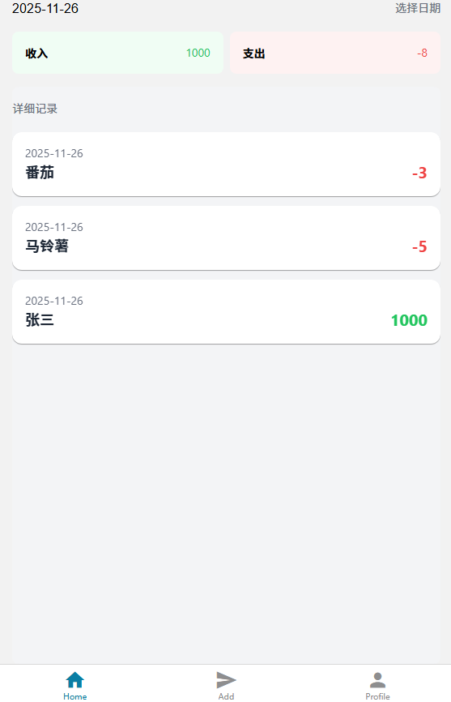
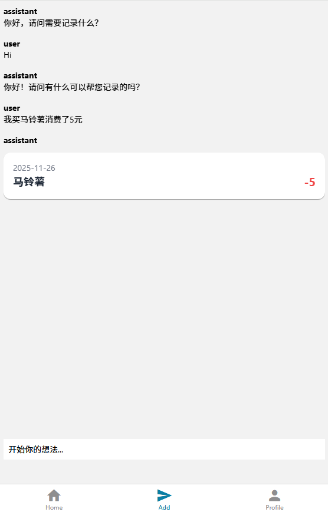
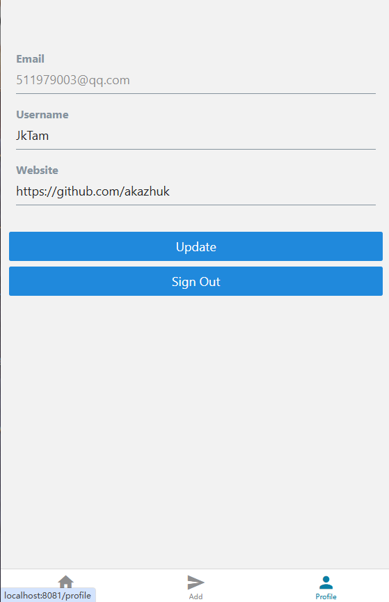

# **📒**AI记账项目 

通过项目的搭建和对`bug`的修复，让我充分了解并学习了现今最前沿的前端框架、后端服务和`AI`技术

## 描述

- 📋首页：展示消费、收入记录
- 💬对话页：跟`AI`对话，通过输入消费/收入文字，让`AI`格式化为特定的`JSON`格式，然后调用`ORM`存入数据表
- 👤个人信息页：登录、登出

## 技术栈

- 移动端: 

  - 框架：🔼`React native (Expo) `

  - 状态管理： 🐻`Zustand `

- 后端: 
  - `Nodejs`框架：🍀`Express` +` Typescript `
  - 登录注册： 🔐`Supabase Auth` + `JWT `
  - 对话功能实现： 🤖`AI SDK `
  - 数据库： **💾**`Postgresql `
  - ORM：🔗` Drizzle `
  - 对话模型： 🐳`Deepseek`

## 功能

1. 登录注册 
2. 对话功能 
   - 普通对话 
   - 理解自然语言转换成账单 
3. 首页数据展示，并且可以切换不同的日期

## 功能截图

首页：

对话页：

个人中心：

